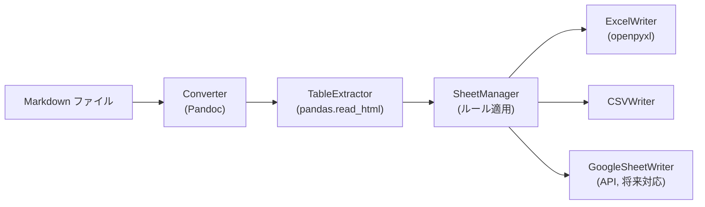

# アーキテクチャ設計書 v1.0 - md2sheet

## 1. システム概要
md2sheet は、Markdown ファイルに記述された表を解析し、  
Excel / CSV / Google Sheet に変換する CLI ツールである。  

本ドキュメントでは、システム構成、利用技術、データフロー、および非機能要件について記述する。  

---

## 2. システム構成
- **入力**: Markdown ファイル (.md)  
- **処理**:  
  1. Pandoc により Markdown → HTML 変換  
  2. pandas により HTML テーブル抽出  
  3. 分割ルール適用 (SheetManager)  
  4. Excel / CSV / Google Sheet 出力  
- **出力**: Excel ファイル (.xlsx) / CSV ファイル / Google Sheet  

---

## 3. 利用技術
| 分類         | 技術/ライブラリ          | 用途 |
|--------------|-------------------------|------|
| 言語         | Python 3.12+            | 実装言語 |
| 外部ツール   | Pandoc                  | Markdown → HTML 変換 |
| ライブラリ   | pandas                  | テーブル抽出 |
|              | openpyxl                | Excel 出力 |
|              | google-api-python-client| Google Sheets API 連携（将来対応） |

---

## 4. アーキテクチャ図

## 5. データフロー
1. ユーザー入力により Markdown ファイルを指定  
2. Pandoc により HTML ファイルを生成  
3. pandas が HTML 内の `<table>` を解析し DataFrame 化  
4. SheetManager がシート分割ルールを適用  
5. Writer により Excel / CSV / Google Sheet 形式に出力  

---

## 6. 非機能要件
- **可搬性**: クロスプラットフォーム対応（Mac / Windows / Linux）  
- **性能**: 1MB 程度の Markdown を 5 秒以内に処理  
- **拡張性**: 出力先モジュールの追加が容易（例: JSON 出力）  
- **保守性**: モジュール単位でのテスト可能性を確保  

---

## 7. 今後の課題
- Google Sheets API の正式実装  
- CI/CD パイプラインによる自動変換  
- Markdown 内部の複雑レイアウト対応（結合セル等）  
